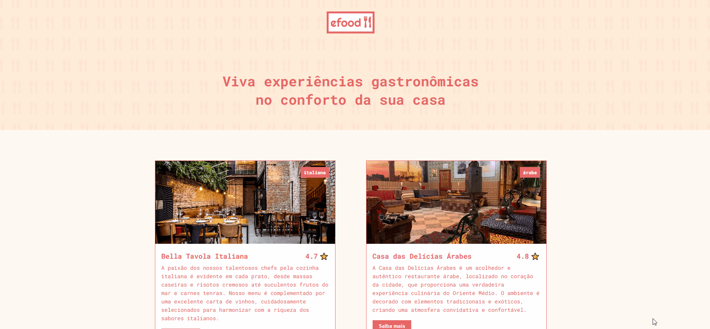
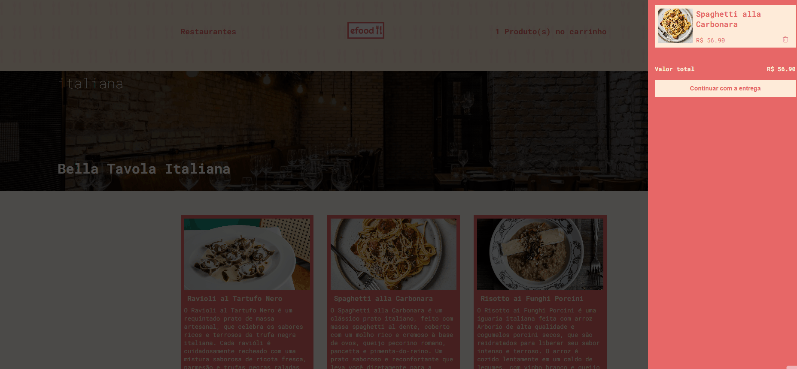

# E-Food

 Aplicação web de delivery desenvolvida para estudos de **React e arquitetura de aplicações modernas.**
O projeto consome uma API para listar restaurantes e permite realizar um fluxo completo de compra, incluindo carrinho, formulário de entrega, pagamento e confirmação do pedido.
---

## Deploy

 [Veja online](https://e-food-vitor.vercel.app/)
---

## Funcionalidades

- Listagem de restaurantes consumindo API
- Página individual de cada restaurante
- Modal com detalhes dos pratos
- Adição e remoção de itens do carrinho
- Fluxo completo de Checkout:
    - Carrinho
    - Endereço de entrega
    - Pagamento
    - Confirmação de pedido
- Validação de formulários
- Interface responsiva.
Focada em proporcionar uma melhor experiência ao usuário.
---

## Tecnologias utilizadas


---
## Preview

 Interface inspirada em aplicações de delivery, com foco em experiência do usuário e organização de componentes.
---

---

---

---

---

---
---

### Como executar o projeto
- Clone o repositorio:
  - git clone https://github.com/vitordrs/eFood.git
- Entre na pasta do projeto:
  - cd eFood
- Instale as dependências:
 - npm install
- Execute o projeto:
 - npm run dev
O projeto ficará disponível em:
*http://localhost:5173*
*(ou na porta configurada do seu ambiente)*
---

### Estrutura do projeto
```
src
 ├─ components
 ├─ pages
 ├─ store
 │   └─ reducers
 ├─ assets
 ├─ globalStyles
 └─ App.tsx
```

- **components** → componentes reutilizáveis
- **pages** → páginas principais da aplicação
- **store** → gerenciamento de estado com Redux
- **assets** → imagens e recursos
- **globalStyles** → estilos globais

---

### Objetivo do projeto
Este projeto foi desenvolvido como parte dos estudos em **desenvolvimento front-end com React**, com foco em:
- componentização
- gerencimento de estado
- consumo de API
- validação de formulários
- organização de código
Layout responsivo para smartphone e tablet
---
##  Desafios encontrados

Alguns dos principais desafios durante o desenvolvimento foram:
- Estruturar corretamente o fluxo de checkout entre carrinho, entrega, pagamento e confirmação
- Gerenciar o estado global do carrinho utilizando Redux Toolkit
- Implementar validação eficiente dos formulários de entrega e pagamento
- Ajustar a responsividade da aplicação para diferentes tamanhos de tela

---
## Autor
Desenvolvido por **Vitor dos Reis Soares**
---
**Projeto desenvolvido para fins educacionais**
